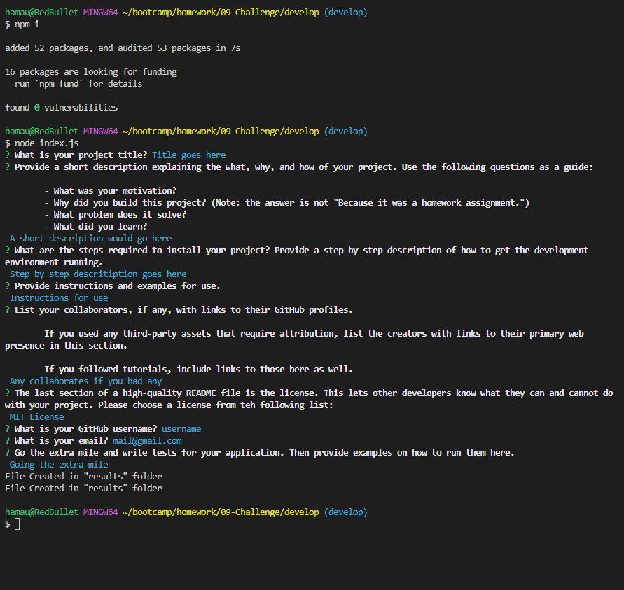

# README Generator

## Description

This project was created to be able to make professional README files using Nodejs. It provides a structure for the user to use so they can create better quality README files. I was able to put in practice using npm, the file system from node.js and using the terminal. 

## Installation

- Have Nodejs installed (I used v16.18)
- Install npm dependencies 
    - use 'npm install' on terminal once navigated to folder

## Usage

Navigate to folder where index.js is located then run the file using node, "node index.js". You will be given different prompts to create a README for your project. Type in your responses until all prompts are answered. License section will be a selectable list which can be navigated using your arrow keys then selected with 'Enter" key. Once completed two lines of "File created in "results" folder" should be displayed in your terminal signifying the files where created successfully. Navigate to your 'results' folder and your README.md and LICENSE files should be located inside populated with the information you provided. Please see [Video demestration](https://drive.google.com/file/d/12lrg-eWLFJg9FQmMeFf1DPwfMkvUZeud/view) for a preview.

## License

N/A